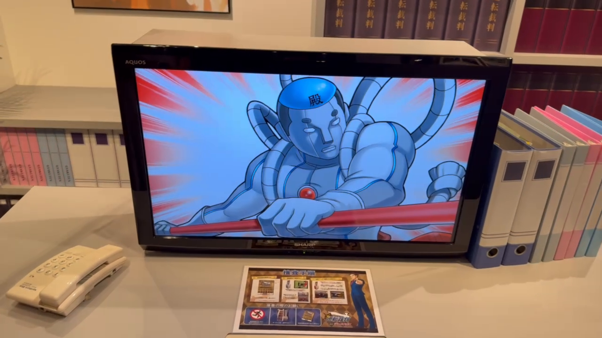
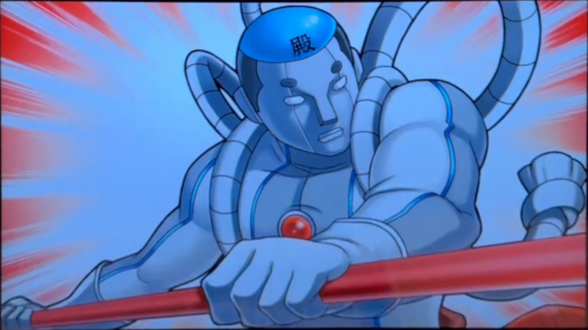
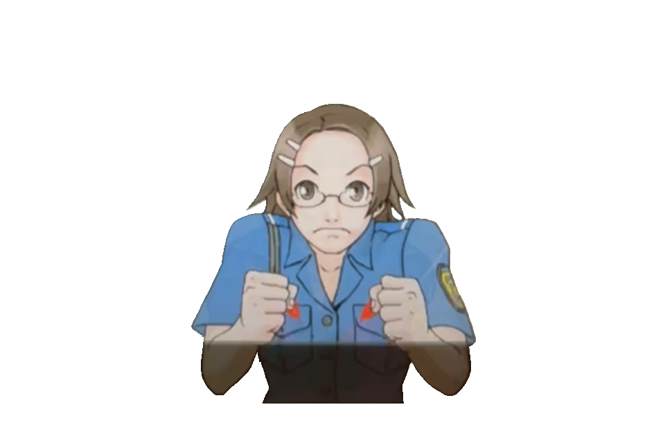
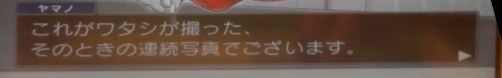
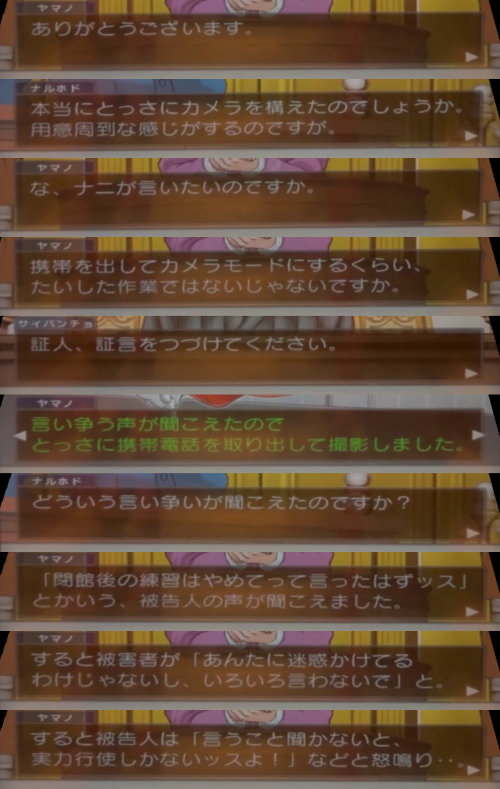

## Asset Recreation Workflow

The recreation pipeline was consistent across all assets, whether they were sprites, backgrounds, or CG illustrations.

### 1. Video Frame Preparation

The source footage was first corrected for perspective and stabilized frame by frame. This step was essential to recover cleaner base material before any artistic cleanup.




### 2. Manual Cleanup in GIMP

After stabilization, each frame was edited in GIMP to remove color casts (especially the blue tint visible on some screens) and restore neutral tones.

For character assets, the sprite was isolated from the background and resized to match official references for that character, keeping proportions consistent with the original games.



### 3. AI-Assisted Restoration

The cleaned images were then processed with Nano Banana Pro (Google's image generation model) to improve line quality, repair artifacts, and reconstruct missing visual information.

### 4. Final Matching and Quality Pass

AI output was not used as-is. Every result was manually adjusted to align with the visual style and sprite standards from the 2012 iOS release of the original Ace Attorney Trilogy.

This final pass included palette correction, shape cleanup, and consistency checks against known reference sprites.


### 5. Animation Standards

Sprite animation timing and movement were matched to the 2012 iOS port wherever possible.

Don is the only fully new character, so his animations were built from video references rather than direct in-game sprite references.

### 6. Text Recovery

Text extraction used AI as the primary transcription method. Traditional OCR was tested first, but it produced noisy and inconsistent results that required heavy manual correction.

Using the stabilized video, every frame containing dialogue text was isolated, and only the textbox region was cropped to reduce noise and improve recognition quality.



This extraction was repeated for all text-bearing frames. Frames with incomplete characters, motion blur, or partial transitions were discarded. When multiple frames contained the same line, the cleanest candidate was selected based on character legibility, stroke continuity, and minimal compression artifacts.

Selected frames were then grouped into sheets of 10 panels (a practical batch size for review and prompt consistency) and sent to Google Gemini for transcription.



Example transcript snippet (Gemini output before final proofreading):

```
Panel 1:

    ヤマノ ありがとうございます。 

Panel 2:

    ナルホド 本当にとっさにカメラを構えたのでしょうか。 用意周到な感じがするのですが。 

Panel 3:

    ヤマノ な、ナニが言いたいのですか。 

Panel 4:

    ヤマノ 携帯を出してカメラモードにするくらい、 たいした作業ではないじゃないですか。 

Panel 5:

    サイバンチョ 証人、証言をつづけてください。 

Panel 6:

    ヤマノ 言い争う声が聞こえたので とっさに携帯電話を取り出して撮影しました。 

Panel 7:

    ナルホド どういう言い争いが聞こえたのですか？ 

Panel 8:

    ヤマノ 「閉館後の練習はやめてって言ったはずッス」 とかいう、被告人の声が聞こえました。 

Panel 9:

    ヤマノ すると被害者が「あんたに迷惑かけてる わけじゃないし、いろいろ言わないで」と。 

Panel 10:

    ヤマノ すると被告人は「言うこと聞かないと、 実力行使しかないッスよ！」などと怒鳴り･･。
```

Gemini's output was then proofread against the original video. Missing lines were restored manually, and transcription errors were corrected case by case.

This final verification pass ensured that punctuation, speaker names, and line order matched the in-game sequence as accurately as possible.