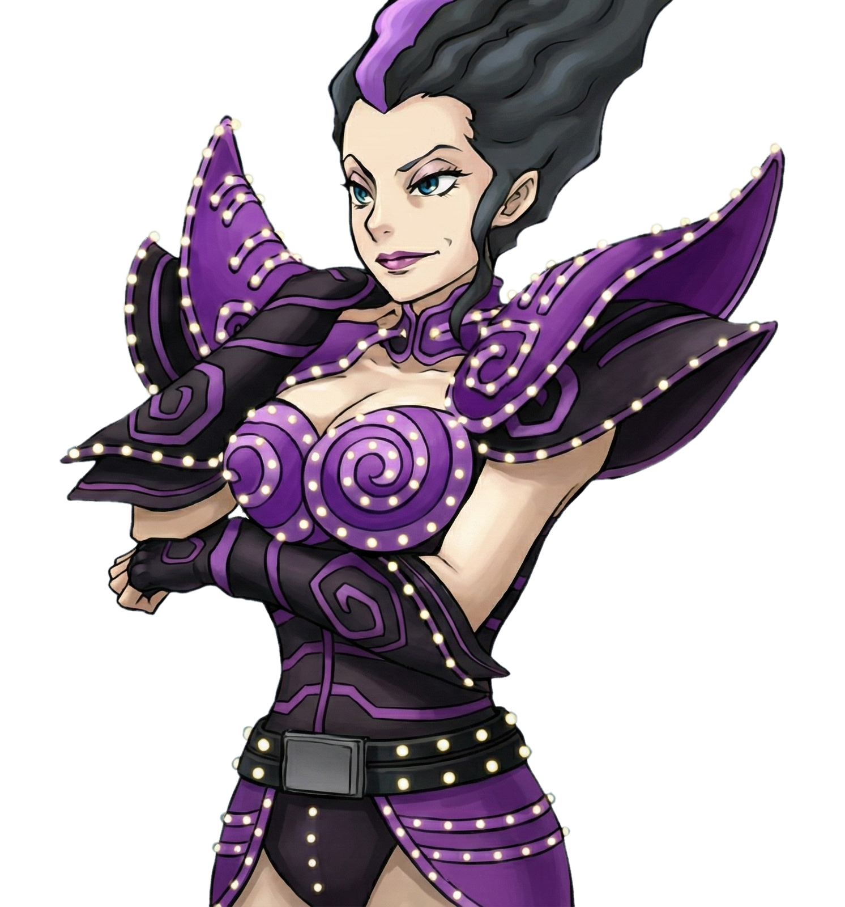
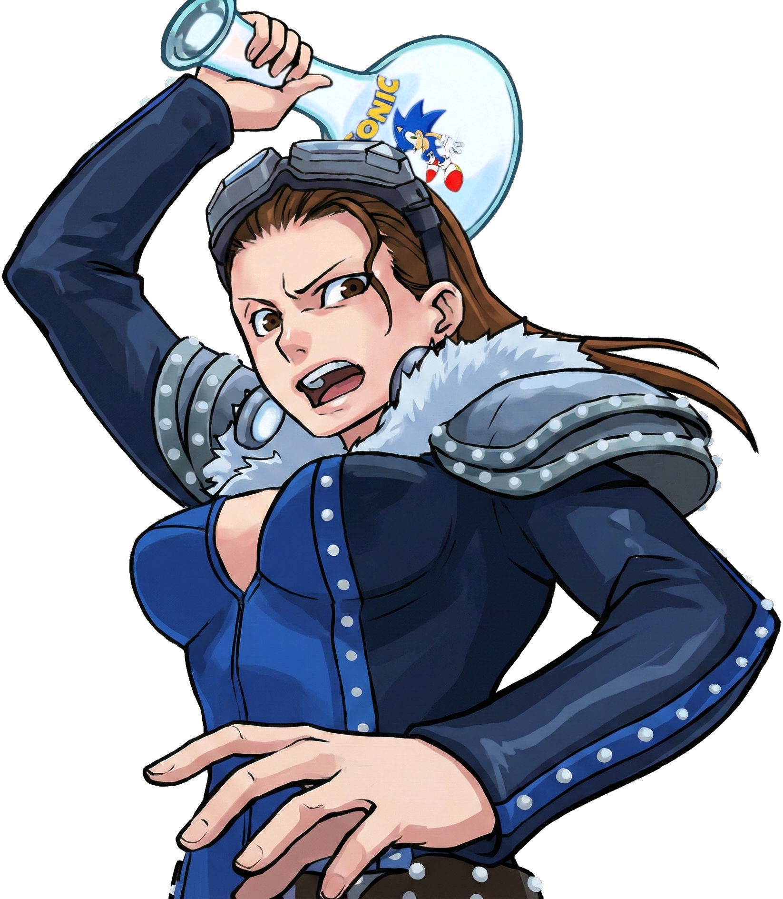

# CG Images

This folder contains all CG (Computer Graphics) images for the Gyakuten Saiban cases.

## Cases

### Don - CG Images

CG artwork for the Don case.

#### Ending - Turnabout Don (Maya)

#### Ending - Turnabout Don (Mia)

#### Intro Scene

#### Crime scene

---

### Fly High - CG Images

CG artwork for the Fly High case.

#### Ending - Turnabout Fly High

#### Blog Post

#### Byrde and Kurumi

#### Intro Clouds Background

#### Intro Hand

#### Sahwit Intro 1

#### Sahwit Intro 2

#### Sahwit Intro 3

#### Sahwit Intro Back

#### Samurai 1

#### Samurai 2

#### Samurai 3

#### Samurai 3-1

#### Samurai 4

#### Samurai 5

#### Samurai 6

#### Samurai 7

#### Samurai 7-1

#### Samurai 7-2

---

### Locked Room - CG Images

CG artwork for the Locked Room case.

#### Ending - Turnabout Locked Room

#### Intro 1

#### Intro 2 - Variant 0

#### Intro 2 - Variant 1

#### Intro 2 - Variant 2

#### Intro Background

#### Victim

#### Will Powers - Variant 0

#### Will Powers - Variant 1

#### Will Powers - Variant 2

