# Don Character Sprites

This folder contains character sprites for Don (Kogyoin Don) from the Don case, organized by category.

## Dressed

Standard animations with Don in his full suit.

### Don - Normal
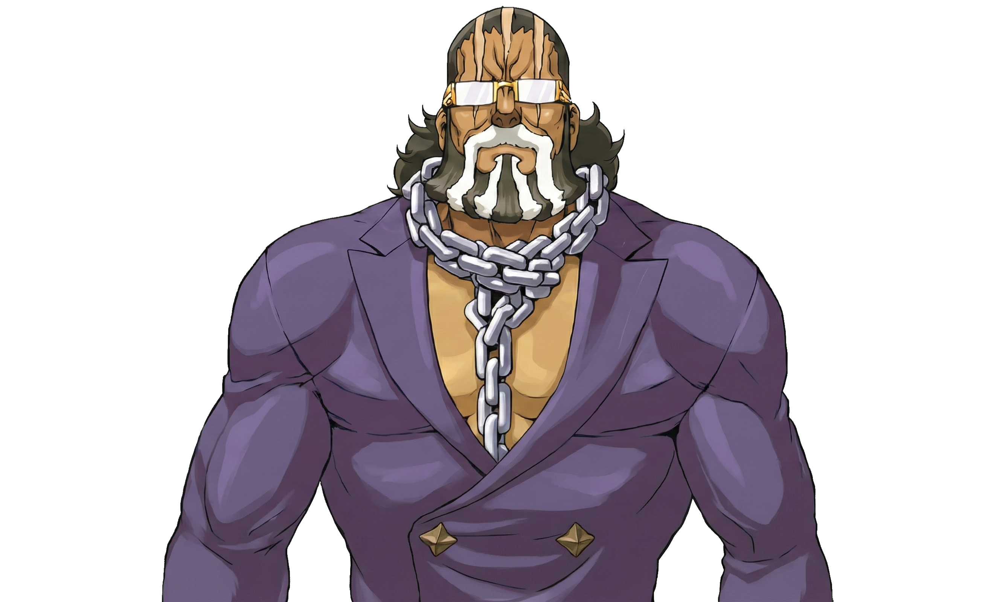
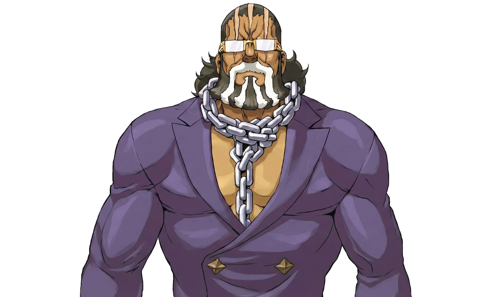

### Don - Smiling
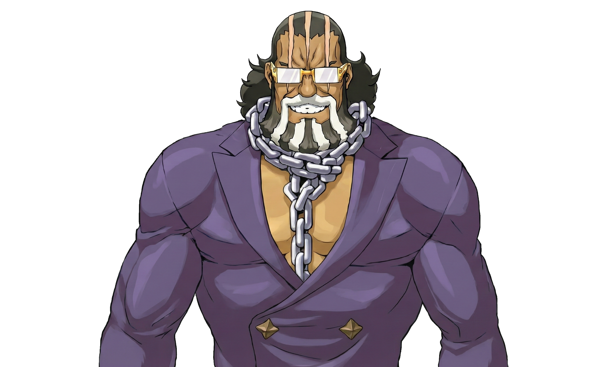

### Don - Smiling (Arm Flexed)
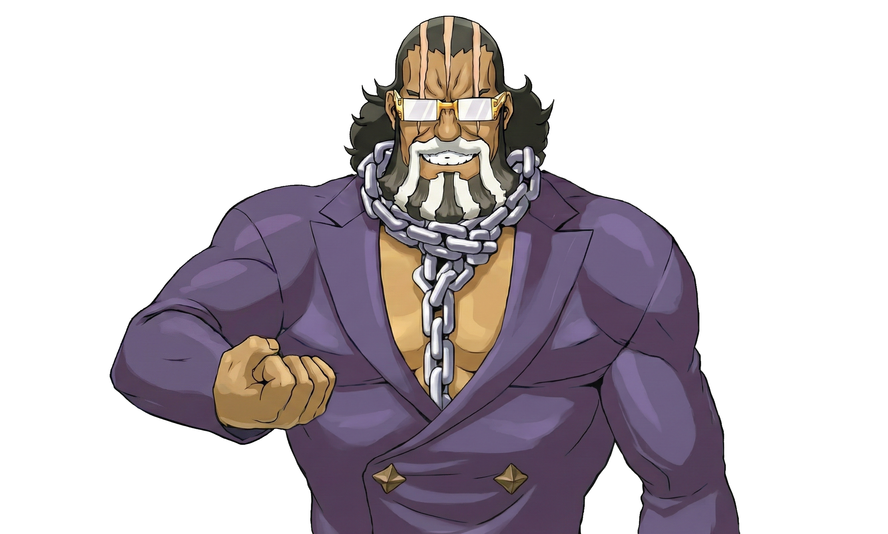
### Don - Laughing
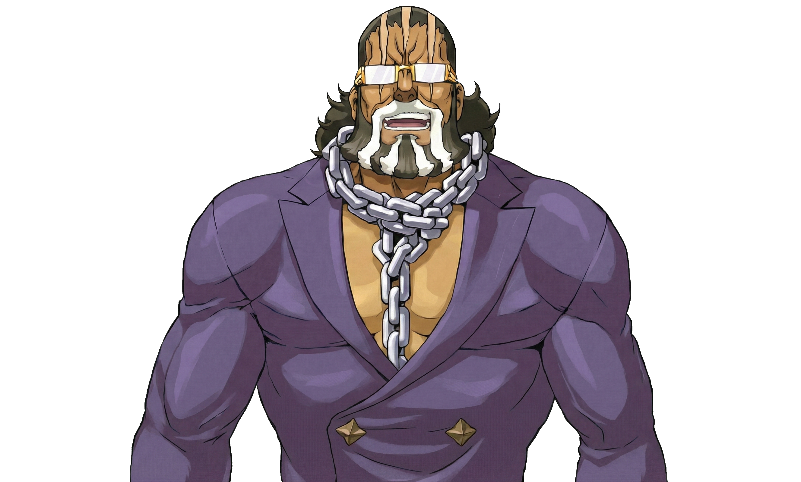

### Don - Fixing glasses

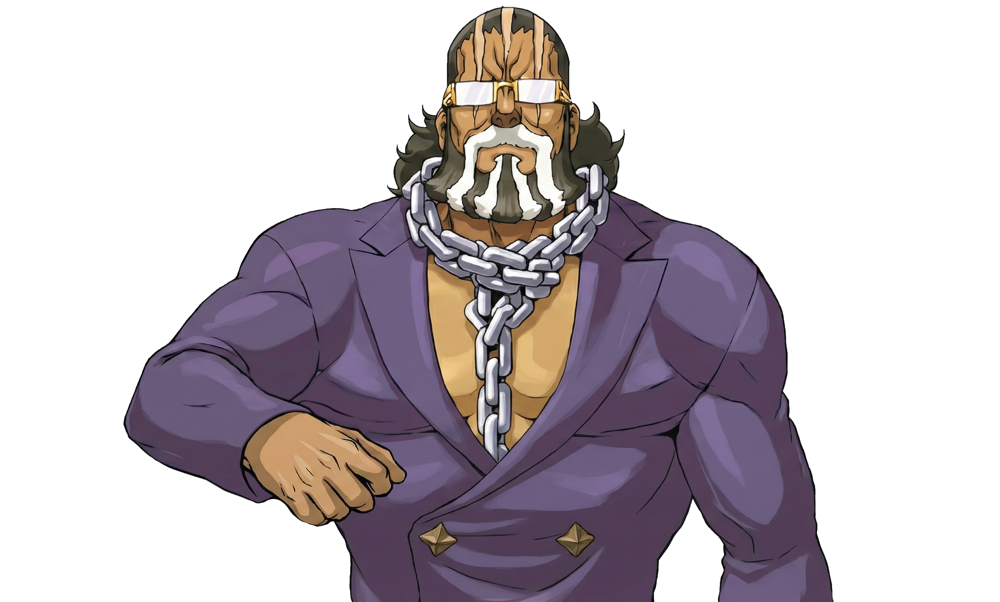

### Don - Peaking through glasses

## Shirtless

Animations of Don after removing his shirt.

### Don - Shirtless Normal
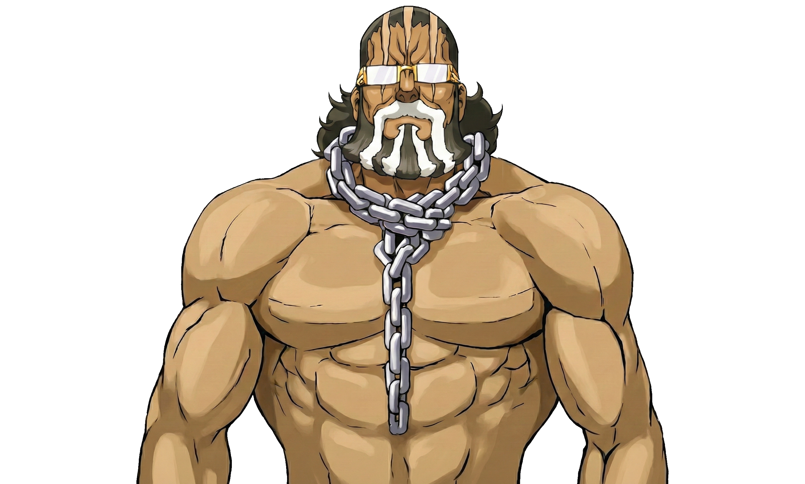
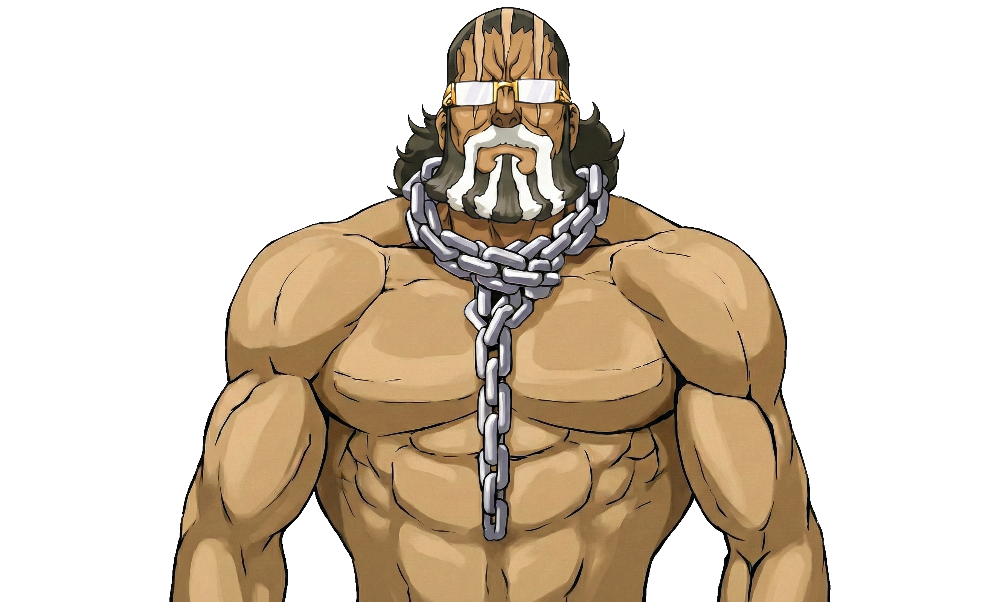

### Don - Shirtless Smiling
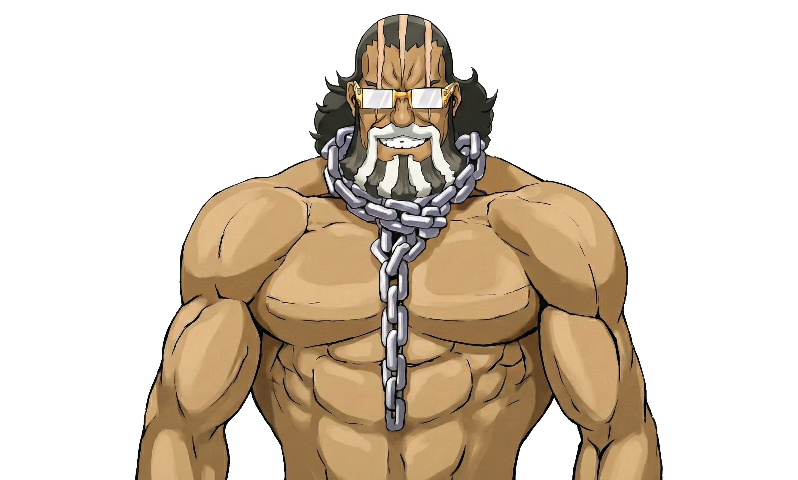
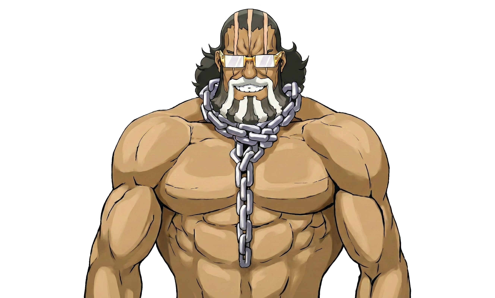

### Don - Shirtless Laughing
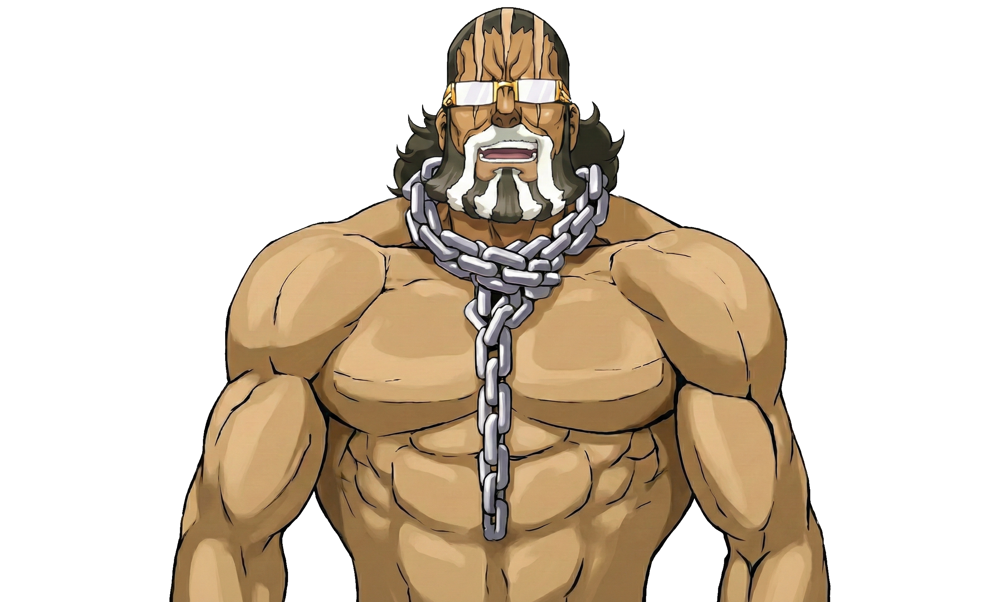

### Don - Shirtless Fixing glasses

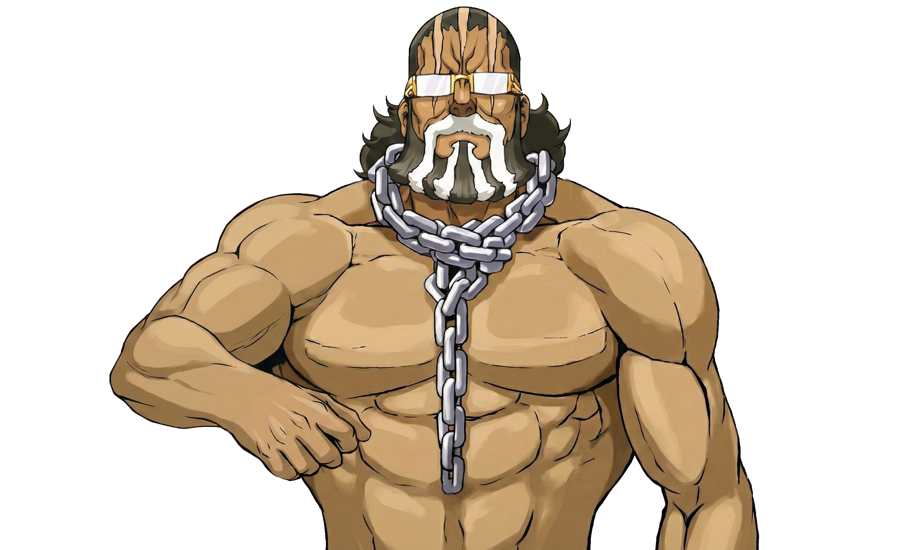

### Don - Shirtless Peaking through glasses

### Don - Shirtless Chain Pull

## Special Animations

Special sequences and action animations.

### Breaking Fruit

Animations involving the melon props.

#### Don - Break Watermelon

#### Don - Break Jackfruit

#### Don - Break Watermelon

#### Bunny Walking (Melon)

#### Bunny Walking (jackfruit)

#### Bunny Walking (Watermelon)

#### Bunny Walk out

#### Bunny still (empty tray)

#### Bunny still (melon)

#### Bunny still (jackfruit)

#### Bunny still (watermelon)

### Breaking Shirt

Animations of the transformation sequence.

### Breakdown

### Don - Breakdown animation

### Don - Breakdown (Breaking Glasses)

### Don - Breakdown (Breaking Stand)

### Don - After breakdown

### Don - After breakdown (screaming)

